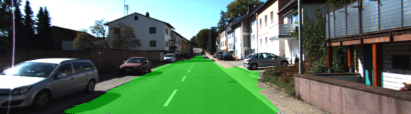

# Semantic Segmentation Project (Advanced Deep Learning) Reflection

## Introduction

The goal of this project is to construct a fully convolutional neural network based on the VGG-16 image classifier architecture for performing semantic segmentation to identify drivable road area from an car dashcam image (trained and tested on the KITTI data set).

## Approach

### Architecture

Pre-trained VGG16 network was used to start
1. Convert fully connected layer7 to 1x1 convolutional network to retain spatial information
2. Upsample output of 1x1 convolutional network by 2
3. Convert output of pool4 to 1x1 convolutional network
4. Do elementwise addition of output from step 2 and 3, it is also called as skipping layers
5. Upsample output of step 4 by 2
6. Convert output of pool3 to 1x1 convolutional network
7. Do elementwise addition of output from step 5 and 6, it is also called as skipping layers
8. Upsample output of step 7 by 4

This architecture uses FCN to retain spatial information and transposed convolution to upsample
the output. Also, skipping layers are added to gain more information.

### Training

The loss function for the network is cross-entropy, and an Adam optimizer is used.

The hyperparameters used for training are:

  - keep_prob: 0.5
  - learning_rate: 0.0001
  - epochs: 50
  - batch_size: 20

Loss trend over epoch with epochs = 5 and batch size = 5, it goes till 0.7. No improvement after that. Increasing batch size results in much better improvement with loss of just 0.1 after 5 epochs. I increased number of epochs to 50 which helped to get loss under 0.02.

### Output

